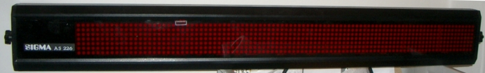
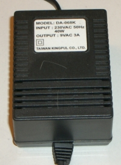
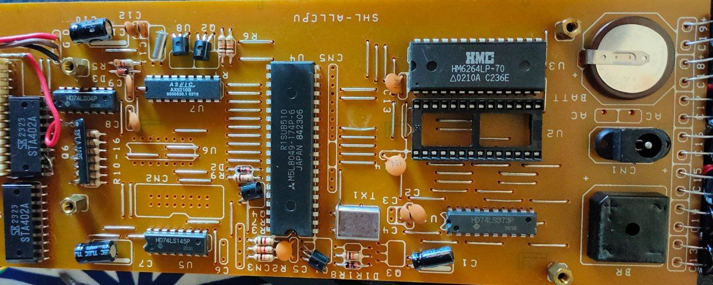
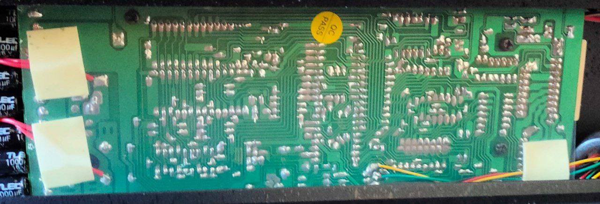
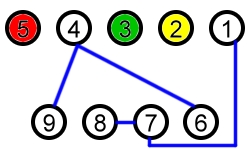
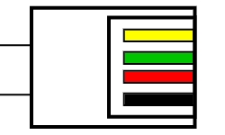
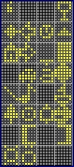
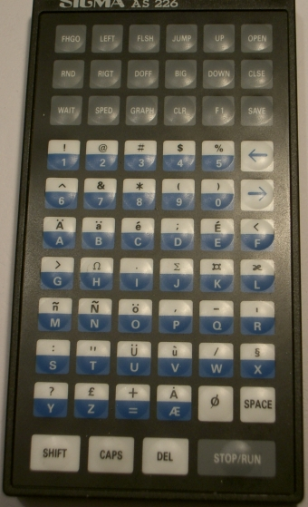

# SIGMA AS 226

## Power supply

|||
|-|-|
|MODEL|DA-068K|
|INPUT|230VAC 50Hz 40W|
|OUTPUT|9VAC 3A|

## Main Board

### Microcontroller

[Mitsubishi M5l8048](https://happytrees.org/files/chips/datasheets/datasheet-Mitsubishi--M5L8049--M5L8039.pdf)

* [Reference manual](http://www.bitsavers.org/components/mitsubishi/_dataBooks/1986_Mitsubishi_Single_Chip_8-Bit_Vol2.pdf)
* MELPS 8-48 architecture
* 6 MHz
* Internal ROM
* 128 Bytes RAM
* 2 KB ROM (?)

### External RAM

[HM6264LP-70](https://www.alldatasheet.com/datasheet-pdf/pdf/64396/hitachi/hm6264lp-70.html)

* 8192 Bytes
* Connected to the battery
* It keeps the programmed text
* Connected to the EPROM, maybe the EPROM reloads the default data to the RAM if the battery is low?

### EPROM

[Intel D27128](https://archive.org/details/IntelD27128Datasheet)

* 128 Kb
* Dumped the content on `/Eprom dump`
* [Dumping tutorial](https://danceswithferrets.org/geekblog/?p=315)
* Fixed dumper code on `/Intel-Eprom-code`

### Clock Ic (?)

ASLC AX5210B

* did not find any info about this
* connected to the battery
* maybe is the IC for the real time clock functionality?

## RS232

  
RS-232 DE-9 female connector with view from the front into the connector. Blue = bridges

* 2 - RXD (receive data)
* 3 - TXD (transmit data)
* 5 - GND (ground)
* 4(DRT) + 6(DSR) + 9(RI)
* 1(DCD) + 7(RTS) + 8(CTS)

  
Assignment of the RJ11 connector
with a view from above of the contacts.
Black = unused

[a pretty good documentation(it is in german)](http://sigma.haufe.org/index.php?content=home).
Only the RX line is really connected to the microcontroller. Also, the microcontroller does not have a serial port, so it is implemented virtually, using the interupt pin.

## Functions

|function|HEX|DEC|Description|
|-----|- |-|-|
|     |0xAA|170|Initializing the scrolling text|
|START|0xBB|187|Program start|
|END  |0x80|128|End of program|
|CLEAR|0x8C|140|Clear display|
|LEFT |0x81|129|Text scrolls to the left|
|RIGHT|0x82|130|Text scrolls to the right|
|UP   |0x83|131|Text scrolls from bottom to top|
|DOWN |0x84|132|Text scrolls from top to bottom|
|JUMP |0x85|133|Text appears immediately without effect|
|OPEN |0x86|134|Open from the inside|
|CLOSE|0x87|135|Close from the outside|
|FLASH|0x88|136|Text flashes|
|FLSHG|0x89|137|Text scrolls blinking from right to left|
|DOFF |0x8A|138|Letters appear individually, from left to right|
|BIG  |0x8B|139|Bold scrolls from right to left|
|RANDM|0x8E|142|Random selection of the effect|
|SPEED|0x8D|141|Speed ​​of the display. Must be followed by a number from 1-9, 1=fast and 9=slow|
|WAIT |0x8F|143|Pause in the display. Must be followed by a number from 1-9, 1=fast and 9=slow|
|1    |0x31|49|Number 1 for setting `DELAY` and `WAIT`|
|2    |0x32|50|Number 2 for setting `DELAY` and `WAIT`|
|3    |0x33|51|Number 3 for setting `DELAY` and `WAIT`|
|4    |0x34|52|Number 4 for setting `DELAY` and `WAIT`|
|5    |0x35|53|Number 5 for setting `DELAY` and `WAIT`|
|6    |0x36|54|Number 6 for setting `DELAY` and `WAIT`|
|7    |0x37|55|Number 7 for setting `DELAY` and `WAIT`|
|8    |0x38|56|Number 8 for setting `DELAY` and `WAIT`|
|9    |0x39|57|Number 9 for setting `DELAY` and `WAIT`|

## Graphics

|||||
|-|-|-|-|
|0x00 (000)|0x08 (008)|0x10 (016)|0x18 (024)|
|0x01 (001)|0x09 (009)|0x11 (017)|0x19 (025)|
|0x02 (002)|0x0A (010)|0x12 (018)|0x1A (026)|
|0x03 (003)|0x0B (011)|0x13 (019)|0x1B (027)|
|0x04 (004)|0x0C (012)|0x14 (020)|0x1C (028)|
|0x05 (005)|0x0D (013)|0x15 (021)|0x1D (029)|
|0x06 (006)|0x0E (014)|0x16 (022)|0x1E (030)|
|0x07 (007)|0x0F (015)|0x17 (023)|0x1F (031)|

## Programming

The scrolling text must be initialized before you begin programming so that it will even "listen". You send the control character for initialization (Hex AA, Dec 170). However, since you don't know whether the command has been received, since the scrolling text generally doesn't respond, and it often doesn't react to the first "call", you simply send the initialization 10 times. This technique is used in the original software.

Fundamentally, a program must have a beginning and an end. So, you have to start the program with the `START` tag and end it with the `END` tag. The `END` tag also ensures that the program starts playing. As soon as the scrolling text receives the `END` tag, it starts playing

For characters use ASCII encodings.

### Example

`START` `UP` GOOD `DOWN` DAY `END`  
`AA AA AA AA AA AA AA AA AA AA` `BB` `83` 47 4F 4F 44 `84` 44 41 59 `80`

Remote image with suported characters:

## Python scripts

### enconde_and_send.py

It will program the content of `text.txt` to the display.

### tg_bot.py

A small Telegram bot that will send the messages replayed with the `/display` command or a formated text with `/gen`.
